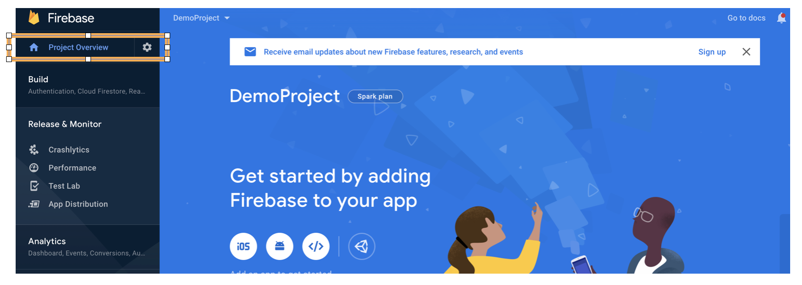
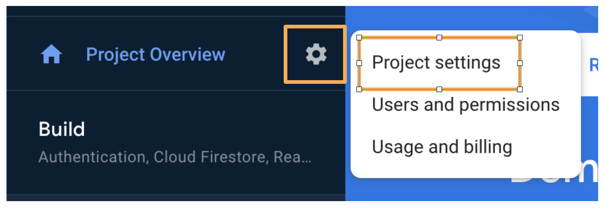
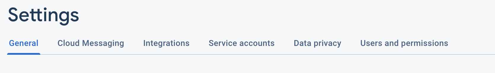

id: ci-cd-workshop-source

summary: This is the workshop of the CI/CD implementation, on the Android Academy series.

authors: Artyom Okun, Nitzan Werber

# Android Academy CI/CD Workshop Dec 2020
<!-- ------------------------ -->
## Environment Preparations
Duration: 0:10:00

As a prerequisite for this codelab, you have to set up several environmental preparations. Please follow the instructions [here](https://rtokun.github.io/ci-cd-workshop-prerequisites-site/#0).
These preparations will include:

1. Creation of a new starter application in Android Studio.
2. Creation Github repo and connecting it to the application (important step is verifying the ability not just pulling a code from a remote, but also pushing it to remote).
3. Creation Firebase project and connecting it to the Android application.

### These steps are crucial to the next steps, so please verify their completion.

<!-- ------------------------ -->
##  Run your first CI build
Duration: 0:05:00

### Add workflow file

<span>1.</span> Go to project and create a directory `.github` in the root.<br/>
<span>2.</span> Inside it, create another directory called `workflows` (This is where all the GitHub Actions configuration files go).<br/>
<span>3.</span> Create first configuration file `workflow_1.yaml`.<br/>
<span>4.</span> Open it and add next code (make sure the indentation is exact as in the example, as yaml is sensitive to indentations):

``` yaml
name: "CI Workflow"
on: [push]
	
jobs: 
  build: 
    name: "Build project"
    runs-on: ubuntu-latest
    steps: 
      - name: "Checkout current repository in ubuntu's file system"
        uses: actions/checkout@v1
        
      - name: "Setup JDK 1.8"
        uses: actions/setup-java@v1
        with: 
          java-version: 1.8
          
      - name: "Give Permissions"
        run: chmod +x gradlew
          
      - name: "Builds debug build"
        run: ./gradlew assembleDebug
```
<br/>
<span>5.</span> Commit ang push the changes to origin:

``` bash
git add .
git commit -m "Initial CI script"
git push origin master
```
<br/>
<span>6.</span> Go to your Github repository -> Actions tab.<br/>
<span>7.</span> You should see your CI workflow running and after couple of minutes a result:


### *######## Wait for the lecture to continue. ########*

<!-- ------------------------ -->

## Add Unit Tests
Duration: 0:03:00

### First run unit tests locally

<span>1.</span> Go to your test folder.<br/>
<span>2.</span> Locate `ExampleUnitTest.kt` or other test files and validate the test passes locally by running in command line<br/>

``` bash
./gradlew testDebugUnitTest
```

### Modify `workflow_1.yaml` file:

<span>1.</span> Add to the bottom of your workfow file:<br/>

```yaml
- name: Unit tests
  run: ./gradlew testDebugUnitTest
```

Your complete `workflow_1.yaml` should look like this now:


```YAML
name: "CI Workflow"
on: [push]

jobs:
  build:
    name: "Build project"
    runs-on: ubuntu-latest
    steps:
      - name: "Checkout current repository in ubuntu's file system"
        uses: actions/checkout@v1

      - name: "Setup JDK 1.8"
        uses: actions/setup-java@v1
        with:
          java-version: 1.8
                
      - name: "Give Permissions"
        run: chmod +x gradlew
          
      - name: "Builds debug build"
        run: ./gradlew assembleDebug

      - name: Unit tests
        run: ./gradlew testDebugUnitTest
```

<span>2.</span> Commit and push the changes:

``` bash
git add .
git commit -m "Add unit test to the workflow"
git push origin master
```

<span>3.</span> Verify your remote CI build triggers and passes:


<!-- ------------------------ -->

##  Convert to (unsigned) release build
Duration: 0:03:00

### Modify `workflow_1.yaml` file

&nbsp;&nbsp;<span>1.</span> Change from:<br/>`./gradlew assembleDebug` to `./gradlew assembleRelease`.
<br/>&nbsp;&nbsp;<span>2.</span> Change from:<br/> `./gradlew testDebugUnitTest` to `./gradlew testReleaseUnitTest`.


Your complete `workflow_1.yaml` should look like this now:


```YAML
name: "CI Workflow"
on: [push]

jobs:
  build:
    name: "Build project"
    runs-on: ubuntu-latest
    steps:
      - name: "Checkout current repository in ubuntu's file system"
        uses: actions/checkout@v1

      - name: "Setup JDK 1.8"
        uses: actions/setup-java@v1
        with:
          java-version: 1.8
                
      - name: "Give Permissions"
        run: chmod +x gradlew
          
      - name: "Builds release build"
        run: ./gradlew assembleRelease

      - name: Unit tests
        run: ./gradlew testReleaseUnitTest
```

<br/>&nbsp;&nbsp;<span>3.</span> Commit ang push the changes:

``` bash
git add .
git commit -m "Convert build to release"
git push origin master
```


<br/>&nbsp;&nbsp;<span>4.</span> You should see your CI workflow running and after couple of minutes a result:


#### Now we have a remote build, that creates release APK, but it is unsigned 😢. 

### *######## Wait for the lecture to continue. ########*

<!-- ------------------------ -->

## Signing your release

### Create release.keystore file if not exist yet (skip this step if already have one)

1. Go to ``Android Studio -> Build -> Generate Signed Bundle or APK``.
2. Choose APK and click ``Next``.
3. In the `Keystore Path` click `Create new...`.
4. Follow wizard instructions, fill in relevant data, and remember the created Keystore location.
5. Continue the wizard and build release.apk, just to verify that we can build a release version of the app locally.

### Modify your app/build.gradle

Add next lines inside `android` closure:

```gradle
    signingConfigs {

        //... 

        release {
            storeFile file('keystore.release')
            keyAlias System.getenv("MY_APP_KEY_ALIAS")
            storePassword System.getenv("MY_APP_STORE_PASSWORD")
            keyPassword System.getenv("MY_APP_KEY_PASSWORD")
        }

        buildTypes {
            release {
                // ...
                signingConfig signingConfigs.release
                // ...
            }
        }
    }

```

### Configure environment variables in the Github Repository

<span>1.</span> Go to the github project repository.<br/>
<span>2.</span> Follow the Settings tab.<br/>
<span>3.</span> In the Settings tab go to Secrets on the left menu (If you can't see it - maybe you don't have permissions for this project).<br/>


<span>4.</span>  Now click on the "New Repository Secret" on the right top.<br/>
<span>5.</span>  Give it a name `MY_APP_KEY_ALIAS` and a value you entered during keystore wizard and click `Add secret`:<br/>
<br/>
<span>6.</span>  Repeat steps 4-5 for the `MY_APP_STORE_PASSWORD` and `MY_APP_KEY_PASSWORD`.<br/>

### Upload release.keystore to Github secrets

As we can not upload any files to Github secrets besides strings, we are going to convert our release.keystore to base64 string, store it and during the build process we will convert it back to file.

#### Generate base64 string from release.keystore file (Mac users)

1. Open the terminal in the folder where the Keystore is located at.
2. Run `base64 < your Keystore file name >`.
3. Copy the created string from the terminal.


#### Generate base64 string from release.keystore file (Windows users)

1. Go to this [website](https://base64.guru/converter/encode/file).
2. Upload your `release.keystore` file to there and click `Encode file to Base64 string`.
3. Copy the created string from the output window.

#### Add keystore string to Github secrets (same as we did for the passwords and alias)

1. Go to your `Github repository -> Settings -> Secrets`.
2. Create a new secret and give it the name `ENCODED_KEYSTORE`.
3. Paste the previously copied string as a secret value and save the secret.

#### Modify `workflow_1.yaml` file

<span>1.</span> Add next lines after `Setup JDK 1.8` step:<br/>

``` yaml
- name: Restore release keystore
  run: echo "${{ secrets.ENCODED_KEYSTORE }}" | base64 --decode > app/keystore.release
```
<span>2.</span> Also replace current `Builds release build` step with:

``` yaml
- name: Generate APK
  run: ./gradlew assembleRelease
  env:
    MY_APP_STORE_PASSWORD: ${{ secrets.MY_APP_STORE_PASSWORD }}
    MY_APP_KEY_PASSWORD: ${{ secrets.MY_APP_KEY_PASSWORD }}
    MY_APP_KEY_ALIAS: ${{ secrets.MY_APP_KEY_ALIAS }}
```

Your complete `workflow_1.yaml` should look like this now:


```YAML
name: "CI Workflow"
on: [push]

jobs:
  build:
    name: "Build project"
    runs-on: ubuntu-latest
    steps:
      - name: "Checkout current repository in ubuntu's file system"
        uses: actions/checkout@v1

      - name: "Setup JDK 1.8"
        uses: actions/setup-java@v1
        with:
          java-version: 1.8
          
      - name: "Give Permissions"
        run: chmod +x gradlew

      - name: Restore release keystore
        run: echo "${{ secrets.ENCODED_KEYSTORE }}" | base64 --decode > app/keystore.release

      - name: Unit tests
        run: ./gradlew testReleaseUnitTest

      - name: Generate APK
        run: ./gradlew assembleRelease
        env:
          MY_APP_STORE_PASSWORD: ${{ secrets.MY_APP_STORE_PASSWORD }}
          MY_APP_KEY_PASSWORD: ${{ secrets.MY_APP_KEY_PASSWORD }}
          MY_APP_KEY_ALIAS: ${{ secrets.MY_APP_KEY_ALIAS }}
```

<br/>
<span>3.</span> Commit and push your code and verify remote build passes:


#### Now we have a signed release.apk that we can distribute to our testers. Let's see how to do it in the next step.

### *######## Wait for the lecture to continue. ########*

## Distribute APK via Firebase Distribution

### Important: In the prerequisites of this codelab, you requested to setup Firebase account and acquire the firebase token. If you didn't do it, please do it now, the instructions can be found [here](https://rtokun.github.io/ci-cd-workshop-prerequisites-site/#1)

#### 1. Set Firebase Login token in Github secrets

&nbsp;&nbsp;<span>1.</span> Copy previously acquired firebase token, go to your Github repository and add this token as another secret variable with key `FIREBASE_TOKEN` and value the token itself.<br/>
&nbsp;&nbsp;<span>4.</span> Now go to `Firebase project -> Settings -> General`, scroll down to your application settings and copy `App ID`.<br/>








&nbsp;&nbsp;<span>5.</span> Go to your Github repository and add this id as secret with key `FIREBASE_APP_ID`.<br/>

#### 2. Create a group of testers

1. Go to Firebase console -> In the left menu find `App Distribution`.
2. Click on `Get started` -> `Testers and Groups` tab.
3. Click `Add group`, give it the name `testers` and add at least one email which will get the app updates.

#### 3. Modify `workflow_1.yaml` file

Add these lines at the very bottom:

``` YAML
      - name: upload artifact to Firebase App Distribution
        uses: wzieba/Firebase-Distribution-Github-Action@v1
        with:
          appId: ${{secrets.FIREBASE_APP_ID}}
          token: ${{secrets.FIREBASE_TOKEN}}
          groups: testers
          file: app/build/outputs/apk/release/app-release.apk
```

Your complete `workflow_1.yaml` should look like this now:


```YAML
name: "CI Workflow"
on: [push]

jobs:
  build:
    name: "Build project"
    runs-on: ubuntu-latest
    steps:
      - name: "Checkout current repository in ubuntu's file system"
        uses: actions/checkout@v1

      - name: "Setup JDK 1.8"
        uses: actions/setup-java@v1
        with:
          java-version: 1.8
          
      - name: "Give Permissions"
        run: chmod +x gradlew

      - name: Restore release keystore
        run: echo "${{ secrets.ENCODED_KEYSTORE }}" | base64 --decode > app/keystore.release

      - name: Unit tests
        run: ./gradlew testReleaseUnitTest

      - name: Generate APK
        run: ./gradlew assembleRelease
        env:
          MY_APP_STORE_PASSWORD: ${{ secrets.MY_APP_STORE_PASSWORD }}
          MY_APP_KEY_PASSWORD: ${{ secrets.MY_APP_KEY_PASSWORD }}
          MY_APP_KEY_ALIAS: ${{ secrets.MY_APP_KEY_ALIAS }}

      - name: upload artifact to Firebase App Distribution
        uses: wzieba/Firebase-Distribution-Github-Action@v1
        with:
          appId: ${{secrets.FIREBASE_APP_ID}}
          token: ${{secrets.FIREBASE_TOKEN}}
          groups: testers
          file: app/build/outputs/apk/release/app-release.apk
```

### Commit and push your changes. Now you have a complete working CI/CD pipeline, and all emails in the `testers` group we defined will get a similar email after each successful build:


To summarize what we have now:

1. On each commit and push to the repository, a new release build will be created.
2. Tests will run.
3. If all steps in the pipeline (including tests) are passing the created APK will be uploaded to the Firebase Distribution system. 
4. All users in `testers` group will be notified via email about the new app update and will be able to install it.

### Great success!


