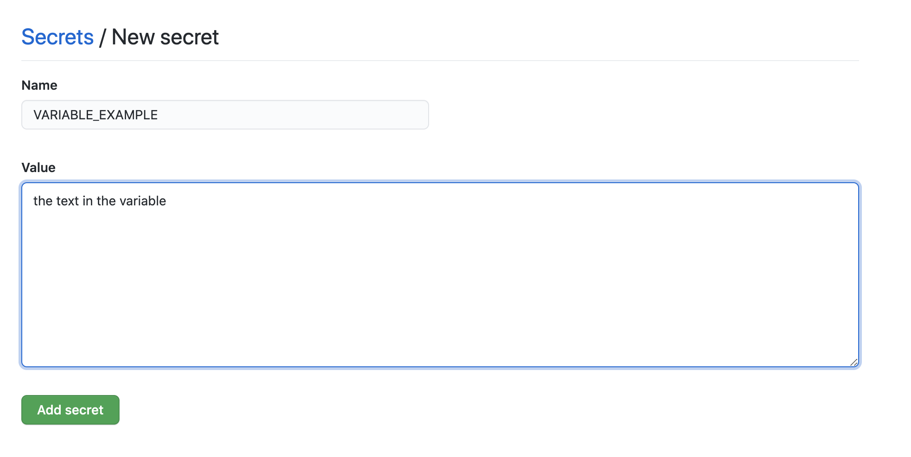

id: ci-cd-workshop-source

summary: This is the workshop of the CI/CD implementation, on the Android Academy series.

authors: Artyom Okun, Nitzan Werber

# Android Academy CI/CD Workshop Dec 2020
<!-- ------------------------ -->
##  Step 1 - Repository Setup
Duration: 0:05:00

### If you've attended Android Academy's previous workshops

- Make sure your starter project is up to date and uploaded to your Github repository.

### If you just came here - welcome! Please fork our starter project into your Github Account

1. In the following link: <https://github.com/AcademyTLV/StartFromScratch>.
2. Go to right top corner and click "Fork".
3. Then go to your forked repository and pull the code to your local machine.
4. Open downloaded file in Android Studio, build and compile.

#### Congrats! We can start with CI related files now :)

<!-- ------------------------ -->
##  Step 2 - Run your first build
Duration: 0:05:00

### Add workflow file

<span>1.</span> Go to project and a directory `.github` in the root.<br/>
<span>2.</span> Inside it, create another directory called `workflows` (This is where all the GitHub Actions configuration files go).<br/>
<span>3.</span> Create first configuration file `workflow_1.yaml`.<br/>
<span>4.</span> Open it and add next code:

```yaml
name: "CI Workflow"
on: [push]
	
jobs: 
  build: 
    name: "Build project"
    runs-on: ubuntu-latest
    steps: 
      - name: "Checkout current repository in ubuntu's file system"
        uses: actions/checkout@v1
      - name: "Setup JDK 1.8"
        uses: actions/setup-java@v1
        with: 
          java-version: 1.8
      - name: "Builds debug build"
        run: ./gradlew assembleDebug
```
<br/>
<span>5.</span> Commit ang push the changes to origin:

``` bash
git add .
git commit -m "Initial build action add"
git push origin master
```
<br/>
<span>6.</span> You should see a result:


<!-- ------------------------ -->

##  Step 3 - Add Unit Tests
Duration: 0:03:00

### Run unit tests locally

<span>1.</span> Go to your test folder.<br/>
<span>2.</span> Locate `ExampleUnitTest.kt` or other test files and validate the test passes locally by running in command line<br/>

``` bash
./gradlew testDebugUnitTest
```

### Modify `.yaml` file:

<span>1.</span> Add to the bottom of your workfow file:<br/>

```yaml
- name: Unit tests
  run: ./gradlew testDebugUnitTest
```

<span>2.</span> Commit ang push the changes:

``` bash
git commit -m "Add unit test to the workflow"
git push origin master
```
<br/>


<!-- ------------------------ -->

##  Step 4 - Convert to release build
Duration: 0:03:00

### Modify `.yaml` file

<span>1.</span> Change from `./gradlew assembleDebug` to `./gradlew assembleRelease`<br/>
<span>2.</span> Change from `./gradlew testDebugUnitTest` to `./gradlew testReleaseUnitTest`<br/>
<span>3.</span> Commit ang push the changes:

``` bash
git commit -m "Convert build to release"
git push origin master
```
<br/>

##Step 5 - Signing your release


##Step 6 - Configure environment variables
Duration: 0:03:00

An environment variable is a dynamic-named value that can affect the way running processes will behave on a computer.

### When running on your local machine there are few ways to use it: 

- run in terminal:

 ```bash 
export MY_ENVIROMENT_VARIABLE = some_value
 ```
 
- add to your `bashrc` file - your bash config file: 

 ``` bash
export MY_ENVIROMENT_VARIABLE = some_value 
```

### But when we run a process the Github Actions' remote machine we define the environment variable in another way:
<span>1.</span> Go to the github project repository.<br/>
<span>2.</span> Follow the Settings tab.<br/>
<span>3.</span> In the Settings tab go to Secrets on the left menu (If you can't see it - maybe you don't have permissions for this project).<br/>


<span>4.</span>  Now click on the "New Repository Secret" on the right top.<br/>
<span>5.</span>  Add a new secret!<br/>



##Step 7 - Add keystore.release to Github secrets storage
Duration: 0:03:00

### 7.1 - Create release.keystore file if not exist yet (skip to step 7.2 if already have one)

1. Go to ``Android Studio -> Build -> Generate Signed Bundle or APK``.
2. Choose APK and click ``Next``.
3. In the `Keystore Path` click `Create new...`.
4. Follow wizard instructions, fill relevant data and remember created keystore location.

### 7.2 - Generate base64 string from release.keystore file

1. Open terminal in the folder where the keystore located at.
2. Run `base64 -w 0 release.keystore | xclip -selection clipboard`(It will also copy the created string to your clipboard).

### 7.3 - Add keystore string to Github secrets

1. Go to your `Github repository -> Settings -> Secrets`.
2. Create new secret and give it name `SIGNING_KEY`.
3. Paste previously copied string as secret value and save the secret.

##Step 8 - Create signed release APK
Duration: 0:03:00

### Modify `.yaml` file:

<span>1.</span> Add these lines after `Grant rights` step:<br/>

```yaml
- name: Restore release keystore
  run: echo "${{ secrets.SIGNING_KEY }}" | base64 --decode > app/release.keystore
```

<span>2.</span> Commit and Push your code.<br/>
<span>2.</span> Verify the build passes.<br/>

##### Now we have release keystore file added on each build, we can use it and sign our application with Github Actions.


// TODO Nitzan - continue from here-->
