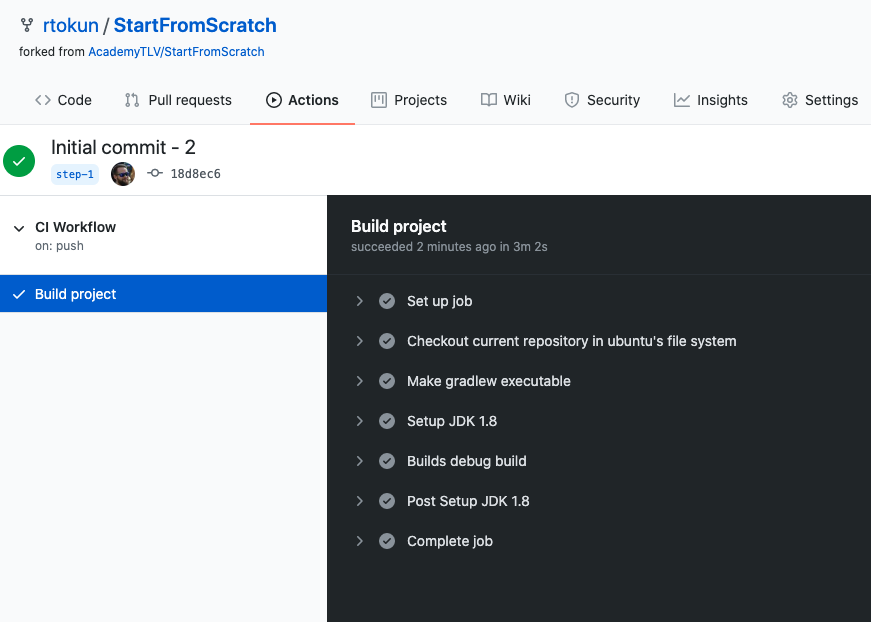

id: ci-cd-workshop-source

summary: This is the workshop of the CI/CD implementation, on the Android Academy series.

authors: Artyom Okun, Nitzan Werber

# Android Academy CI/CD Workshop Dec 2020
<!-- ------------------------ -->
## Repository Setup
Duration: 0:05:00

1. Create a new application in Android Studio (or use your own previously created one).
2. Build and compile a project.
3. Create a Github repository for this project(or skip to the step 4 if you already have one). You can follow the instructions [here](https://docs.github.com/en/free-pro-team@latest/github/getting-started-with-github/create-a-repo).
4. Create first commit (we just want to verify your local copy is synced with Github repo and we can start work on CI/CD, if you have a Github repositore connected to the local project you can skip this step). From the app root folder, open terminal and run:

*Note: pay attention to change a path to Github repository in the next script*

``` bash
git add .
git commit -m "Initial commit"
git remote add origin <path to your repository i.e. git@github.com:rtokun/test-111.git>
git push origin master
```


#### Congrats! We can start with CI related files now :)

<!-- ------------------------ -->
##  Run your first CI build
Duration: 0:05:00

### Add workflow file

<span>1.</span> Go to project and create a directory `.github` in the root.<br/>
<span>2.</span> Inside it, create another directory called `workflows` (This is where all the GitHub Actions configuration files go).<br/>
<span>3.</span> Create first configuration file `workflow_1.yaml`.<br/>
<span>4.</span> Open it and add next code (make sure the indentation is exact as in the example, as yaml is sensitive to indentations):

``` yaml
name: "CI Workflow"
on: [push]
	
jobs: 
  build: 
    name: "Build project"
    runs-on: ubuntu-latest
    steps: 
      - name: "Checkout current repository in ubuntu's file system"
        uses: actions/checkout@v1
      - name: "Setup JDK 1.8"
        uses: actions/setup-java@v1
        with: 
          java-version: 1.8
      - name: "Builds debug build"
        run: ./gradlew assembleDebug
```
<br/>
<span>5.</span> Commit ang push the changes to origin:

``` bash
git add .
git commit -m "Initial CI script"
git push origin master
```
<br/>
<span>6.</span> Go to your Github repository -> Actions tab.<br/>
<span>7.</span> You should see your CI workflow running and after couple of minutes a result:


<!-- ------------------------ -->

## Add Unit Tests
Duration: 0:03:00

### First run unit tests locally

<span>1.</span> Go to your test folder.<br/>
<span>2.</span> Locate `ExampleUnitTest.kt` or other test files and validate the test passes locally by running in command line<br/>

``` bash
./gradlew testDebugUnitTest
```

### Modify `workflow_1.yaml` file:

<span>1.</span> Add to the bottom of your workfow file:<br/>

```yaml
- name: Unit tests
  run: ./gradlew testDebugUnitTest
```

<span>2.</span> Commit and push the changes:

``` bash
git add .
git commit -m "Add unit test to the workflow"
git push origin master
```

<span>3.</span> Verify your remote CI build triggers and passes:


<!-- ------------------------ -->

##  Convert to (unsigned) release build
Duration: 0:03:00

### Modify `workflow_1.yaml` file

&nbsp;&nbsp;<span>1.</span> Change from:<br/>`./gradlew assembleDebug` to `./gradlew assembleRelease`.
<br/>&nbsp;&nbsp;<span>2.</span> Change from:<br/> `./gradlew testDebugUnitTest` to `./gradlew testReleaseUnitTest`.
<br/>&nbsp;&nbsp;<span>3.</span> Commit ang push the changes:

``` bash
git add .
git commit -m "Convert build to release"
git push origin master
```


<br/>&nbsp;&nbsp;<span>4.</span> You should see your CI workflow running and after couple of minutes a result:


#### Now we have a remote build, that creates release APK, but it is unsigned 😢. 

<!-- ------------------------ -->

## Signing your release

### Create release.keystore file if not exist yet (skip this step if already have one)

1. Go to ``Android Studio -> Build -> Generate Signed Bundle or APK``.
2. Choose APK and click ``Next``.
3. In the `Keystore Path` click `Create new...`.
4. Follow wizard instructions, fill relevant data and remember created keystore location.
5. Continue the wizard and build release.apk, just to verify that we are able to build a release version of the app locally.

### Modify your app/build.gradle

Add next lines inside `android` closure:

```gradle
    signingConfigs {

        //... 

        release {
            storeFile file('keystore.release')
            keyAlias System.getenv("MY_APP_KEY_ALIAS")
            storePassword System.getenv("MY_APP_STORE_PASSWORD")
            keyPassword System.getenv("MY_APP_KEY_PASSWORD")
        }

        buildTypes {
            release {
                // ...
                signingConfig signingConfigs.release
                // ...
            }
        }
    }

```

### Configure environment variables in the Github Repository

<span>1.</span> Go to the github project repository.<br/>
<span>2.</span> Follow the Settings tab.<br/>
<span>3.</span> In the Settings tab go to Secrets on the left menu (If you can't see it - maybe you don't have permissions for this project).<br/>


<span>4.</span>  Now click on the "New Repository Secret" on the right top.<br/>
<span>5.</span>  Give it a name `MY_APP_KEY_ALIAS` and a value you entered during keystore wizard and click `Add secret`:<br/>
<br/>
<span>6.</span>  Repeat steps 4-5 for the `MY_APP_STORE_PASSWORD` and `MY_APP_KEY_PASSWORD`.<br/>

### Upload release.keystore to Github secrets

As we can not upload any files to Github secrets besides strings, we are going to convert our release.keystore to base64 string, store it and during the build process we will convert it back to file.

#### Generate base64 string from release.keystore file

1. Open terminal in the folder where the keystore located at.
2. Run `base64 <your keystore file name>`.
3. Copy created string from terminal.

#### Add keystore string to Github secrets (same as we did for the passwords and alias)

1. Go to your `Github repository -> Settings -> Secrets`.
2. Create new secret and give it name `ENCODED_KEYSTORE`.
3. Paste previously copied string as secret value and save the secret.

#### Modify `workflow_1.yaml` file

<span>1.</span> Add next lines after `Setup JDK 1.8` step:<br/>

``` yaml
- name: Restore release keystore
  run: echo "${{ secrets.ENCODED_KEYSTORE }}" | base64 --decode > keystore.release
```
<span>2.</span> Also replace current `Builds debug build` step with:

``` yaml
- name: Generate APK
  run: ./gradlew assembleRelease
  env:
    MY_APP_STORE_PASSWORD: ${{ secrets.MY_APP_STORE_PASSWORD }}
    MY_APP_KEY_PASSWORD: ${{ secrets.MY_APP_KEY_PASSWORD }}
    MY_APP_KEY_ALIAS: ${{ secrets.MY_APP_KEY_ALIAS }}
```
<br/>
<span>3.</span> Commit and push your code and verify remote build passes:


#### Now we have a signed release.apk that we can distribute to our testers. Let's see how to do it ih the next step.

## Distribute APK via Firebase Distribution

### In order to distribute the app via Firebase Distribution we need several things:

1. Create Firebase project for our application.
2. Create Firebase Login token, which will be used for uploading the app to the Firebase.
3. Create group of testers which will get the app updates each time it created.
4. Use Firebase Github action for actually sending the release APK to the Firebase.

#### 1. Create Firebase project for our app

*Note: If you already integrated Firebase to the application and have valid Firebase project + app skip to the step 2*

1. Go to [Firebase console](https://console.firebase.google.com/), login and click `Add project`.
2. Follow the wizard instructions and complete project creation.
3. In the project overview click `Add app`:

4. Select `Android` and follow the wizard. Complete the wizard including downloading `google-services.json` file, and modifying the gradle files.
5. Make sure to compile and run the application on the emulator/device after a successful integration.

#### 2. Create Firebase Login token

This token allows to 3rd party applications (in our case, this 3rd party is Github action, which responsible for uploading the app to the Firebase) get an access to the Firebase project and make operations.
In order to get one we need to install the Firebase console client on our local computer, login via client to our Firebase account.

&nbsp;&nbsp;1.</span> Open terminal and enter<br/>

``` bash
curl -sL https://firebase.tools | bash
```

&nbsp;&nbsp;<span>2.</span> After successful installation enter in terminal:<br/>

``` bash
firebase login:ci
```

It will open browser with Authentication page. Enter your credentials and after succesful authentication go back to your terminal window, you should see there your token:

``` bash
✔  Success! Use this token to login on a CI server:

1//03UkAUZpVhigPCgYIARAAGsotbjnrtl;ghkjnrts;lhkjntw;lhknrt;lhbknwrtl;khn;wlr0VcRQiYGtZSpo7DP1aS7X5OdCVJys
```

&nbsp;&nbsp;<span>3.</span> Copy the token, go to your Github repository and add this token as another secret variable with key `FIREBASE_TOKEN` and value the token itself.<br/>
&nbsp;&nbsp;<span>4.</span> Now go to `Firebase project -> Settings -> General`, scroll down to your application settings and copy `App ID`.<br/>
&nbsp;&nbsp;<span>5.</span> Go to your Github repository and add this id as secret with key `FIREBASE_APP_ID`.<br/>

#### 3. Create group of testers

1. Go to Firebase console -> In the memu select `Release and Monitor` category -> `App Distribution`.
2. Click on `Get started` -> `Testers and Groups` tab.
3. Click `Add group`, give it a name `testers` and add at least one email which will get the app updates.

#### 4. Modify `workflow_1.yaml` file

Add these lines at the very bottom:

``` yaml
      - name: upload artifact to Firebase App Distribution
        uses: wzieba/Firebase-Distribution-Github-Action@v1
        with:
          appId: ${{secrets.FIREBASE_APP_ID}}
          token: ${{secrets.FIREBASE_TOKEN}}
          groups: testers
          file: app/build/outputs/apk/release/app-release.apk
```

### Commit and push your changes. Now you have complete working CI/CD pipeline, and all emails in the `testers` group we defined will get similar email after each successful build:


To summarize what we have now:

1. On each commit and push to the repository, new release build will be created.
2. Tests will run.
3. If all tests are passing the created APK will be uploaded to Firebase Distribution system. 
4. All users in `testers` will be notified via email about new app update and will be able to install it.

### Great success!


